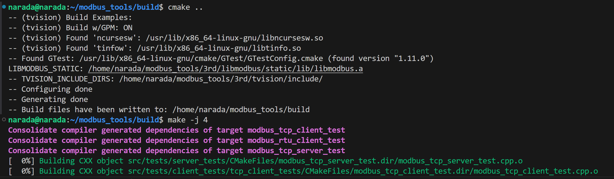
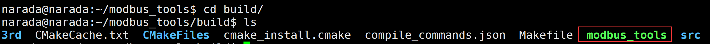
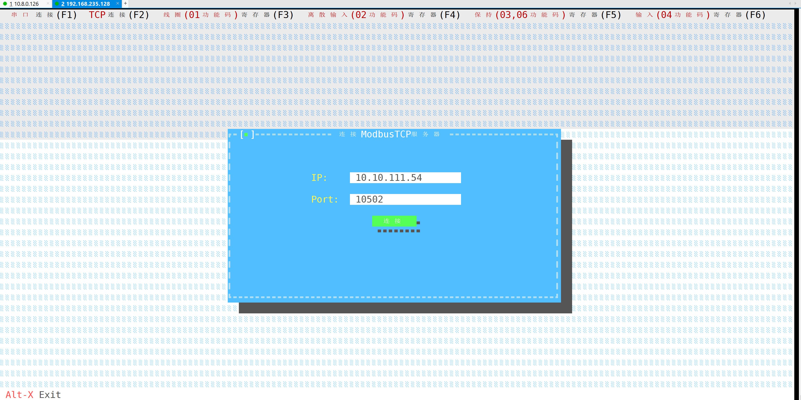
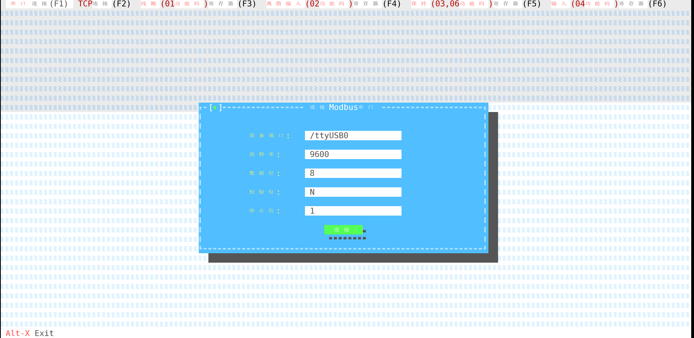
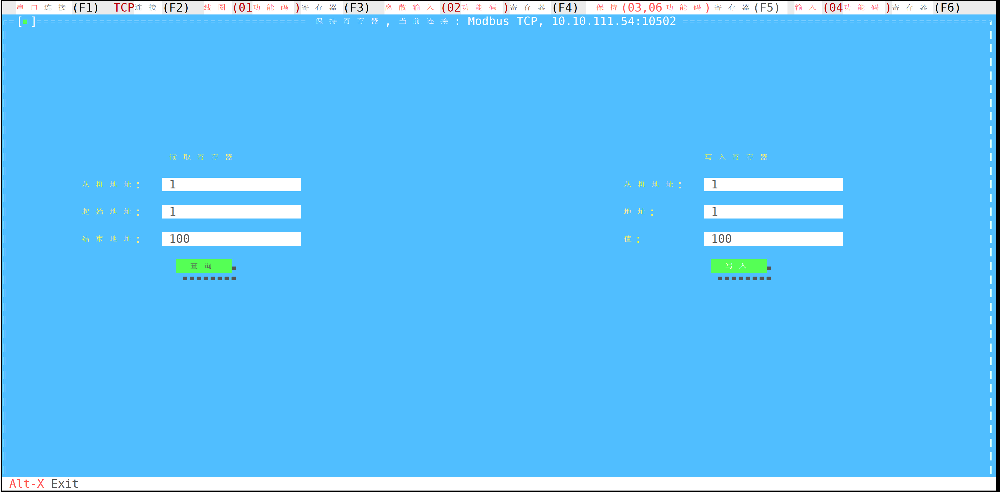
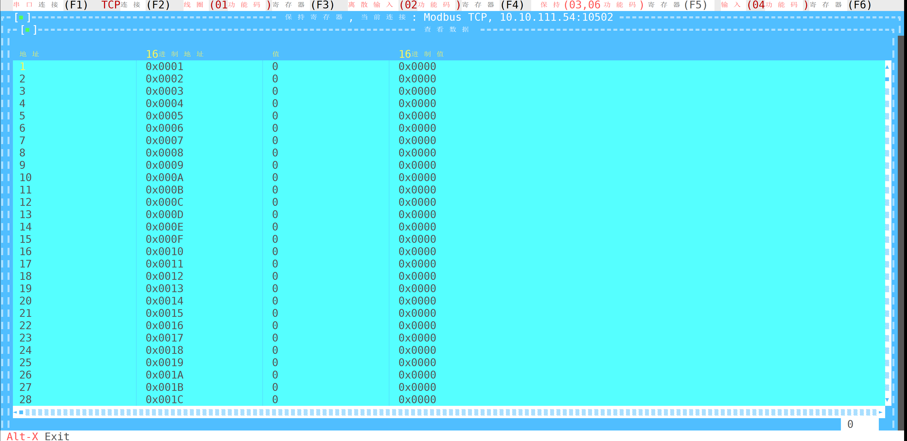

# Linux命令行图形化Modbus调试工具

## 编译

1. 安装前置依赖

   ```shell
   # 安装cmake
   sudo apt install cmake
   # 安装g++
   sudo apt install g++
   # 安装tvision界面库依赖
   sudo apt install libncursesw5-dev
   # 安装gtest,方便单元测试
   sudo apt install libgtest-dev
   ```

2. 新建build目录，进入build目录

   ```
   mkdir build
   cd build
   ```

3. 编译

   ```
   cmake ..
   make -j 4
   ```

   

## 运行

1. 进入build目录，执行./modbus_tools

   ```shell
   cd build
   ./modbus_tools
   ```
   

2. 连接ModbusTcp服务器

   

3. 连接Modbus串口

   

4. 查询和写入保持寄存器

   

5. 查询结果

   

   该工具完全支持无鼠标键盘操作，Esc关闭页面，Tab键切换输入框，上下左右键可用来上下滚动表格。