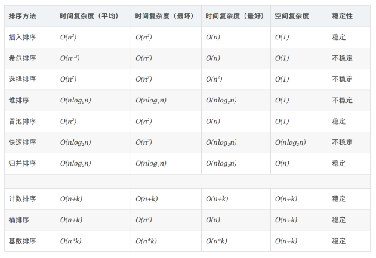

## 一、冒泡排序  
### 算法步骤  
  1. 比较相邻的元素。如果第一个比第二个大，就交换他们两个.  
  2. 对每一对相邻元素作同样的工作，从开始第一对到结尾的最后一对。这步做完后，最后的元素会是最大的数。  
  3. 针对所有的元素重复以上的步骤，除了最后一个。  
  4. 持续每次对越来越少的元素重复上面的步骤，直到没有任何一对数字需要比较。  

### 最快和最慢  
    正序时最快，反序时最慢  

## 二、选择排序
### 算法步骤  
  1. 首先在未排序序列中找到最小（大）元素，存放到排序序列的起始位置  
  2. 再从剩余未排序元素中继续寻找最小（大）元素，然后放到已排序序列的末尾。  
  3. 重复第二步，直到所有元素均排序完毕。

## 三、插入排序  
插入排序的代码实现虽然没有冒泡排序和选择排序那么简单粗暴，但它的原理应该是最容易理解的了，因为只要打过扑克牌的人都应该能够秒懂。插入排序是一种最简单直观的排序算法，它的工作原理是通过构建有序序列，对于未排序数据，在已排序序列中从后向前扫描，找到相应位置并插入。

插入排序和冒泡排序一样，也有一种优化算法，叫做拆半插入。
### 算法步骤  
  1. 将第一待排序序列第一个元素看做一个有序序列，把第二个元素到最后一个元素当成是未排序序列。  
  2. 从头到尾依次扫描未排序序列，将扫描到的每个元素插入有序序列的适当位置。（如果待插入的元素与有序序列中的某个元素相等，则将待插入元素插入到相等元素的后面。）  

## 四、希尔排序  
希尔排序，也称递减增量排序算法，是插入排序的一种更高效的改进版本。但希尔排序是非稳定排序算法。
希尔排序是基于插入排序的以下两点性质而提出改进方法的：  
  1. 插入排序在对几乎已经排好序的数据操作时，效率高，即可以达到线性排序的效率；  
  2. 但插入排序一般来说是低效的，因为插入排序每次只能将数据移动一位；  

希尔排序的基本思想是：先将整个待排序的记录序列分割成为若干子序列分别进行直接插入排序，待整个序列中的记录“基本有序”时，再对全体记录进行依次直接插入排序。
### 算法步骤  
  1. 选择一个增量序列 t1，t2，……，tk，其中 ti > tj, tk = 1；  
  2. 按增量序列个数 k，对序列进行 k 趟排序；  
  3. 每趟排序，根据对应的增量 ti，将待排序列分割成若干长度为 m 的子序列，分别对各子表进行直接插入排序。仅增量因子为 1 时，整个序列作为一个表来处理，表长度即为整个序列的长度。  

## 五、并归排序  
归并排序（Merge sort）是建立在归并操作上的一种有效的排序算法。该算法是采用分治法（Divide and Conquer）的一个非常典型的应用。  
作为一种典型的分而治之思想的算法应用，归并排序的实现由两种方法：  
  1. 自上而下的递归（所有递归的方法都可以用迭代重写，所以就有了第 2 种方法）；  
  2. 自下而上的迭代；
   
和选择排序一样，归并排序的性能不受输入数据的影响，但表现比选择排序好的多，因为始终都是 O(nlogn) 的时间复杂度。代价是需要额外的内存空间。  
### 算法步骤  
  1. 申请空间，使其大小为两个已经排序序列之和，该空间用来存放合并后的序列；  
  2. 设定两个指针，最初位置分别为两个已经排序序列的起始位置；  
  3. 比较两个指针所指向的元素，选择相对小的元素放入到合并空间，并移动指针到下一位置；  
  4. 重复步骤 3 直到某一指针达到序列尾；  
  5. 将另一序列剩下的所有元素直接复制到合并序列尾。  

